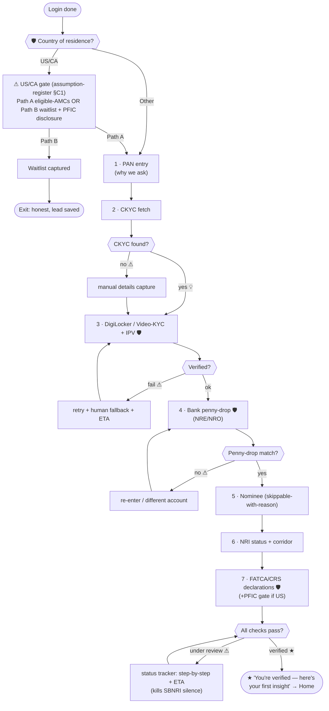
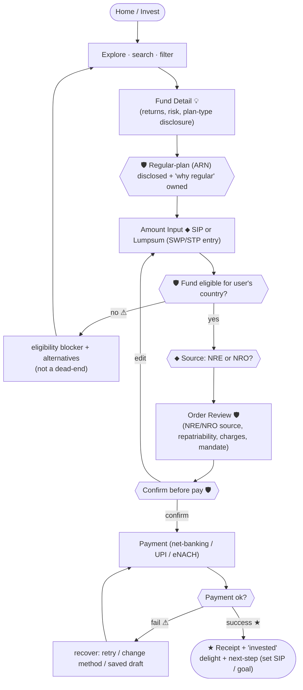
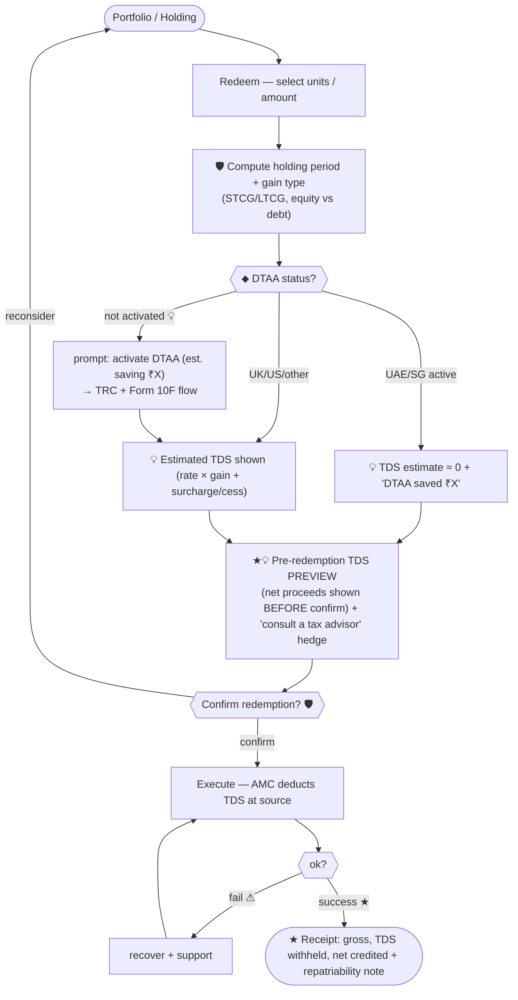
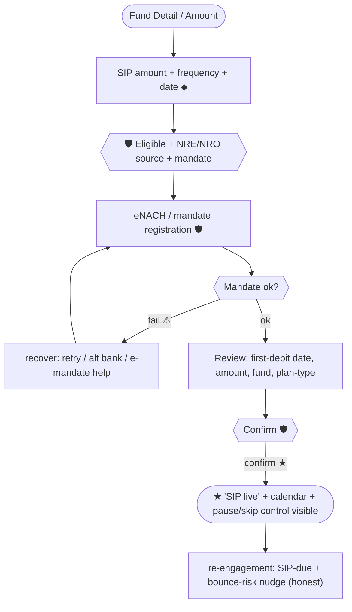

# End-to-End Flows — Phase-1 (Part C)

**Sprint:** Discovery & Definition · Part C (Define)
**Grounded in:** `scope.md`, BRD §3, `05-fintech-nri`, `04-laws-of-ux`, `competitive-analysis.md`

**Legend:** ⬥ decision · ⚠ failure/recover branch · 🛡 compliance checkpoint · ★ peak-end
moment · 💡 hook moment. Failure branches **recover, never dead-end** (rulebook 05).

---

## 1. Onboarding + KYC (7-step smart flow)

**Notes:** progress x/7 always visible (N1); Hick — one thing per screen; Doherty —
optimistic UI + skeletons; re-KYC reuses steps 3/6/7 as touchpoints.

---

## 2. First investment (Explore → Receipt)

**Notes:** SWP/STP are *entry points* only (Phase-1). Peak-End on receipt (rulebook 04).
Fee/charge transparency on the action surface (Wise pattern; rulebook 05).

---

## 3. Redemption WITH tax preview (the differentiator)

**Notes:** this flow is **H1 (spearhead hook)** — the pre-confirm net-of-TDS number is the
whole thesis. Always hedge (ITAT under appeal, BRD §3.4.2). DTAA prompt = H2.

---

## 4. SIP setup

**Notes:** surface **pause/skip** up-front (N3 user control) — reduces anxiety, not churn.
Bounce-risk nudge is honest utility (hook-strategy §4).

---

## Cross-flow compliance checkpoints (🛡 summary)
- **Country eligibility** enforced at KYC (step 6) *and* per-fund at order (BRD; Platform-Notes NOTE 3).
- **NRE/NRO source** explicit at every order/SIP (BRD §2.1).
- **Confirm-before-pay + mandate** on all money movement (rulebook 05).
- **TDS at source** shown *before* redemption confirm (BRD §3.3).
- **DTAA** = TRC + Form 10F states, always hedged (BRD §3.4).
- **FATCA/CRS + PFIC (US)** at onboarding (BRD §3.5).

## Peak-End moments (★ to design with craft)
KYC-verified · first-investment receipt · SIP-live · redemption receipt (net clarity) ·
DTAA-activated ("₹X saved this FY").
