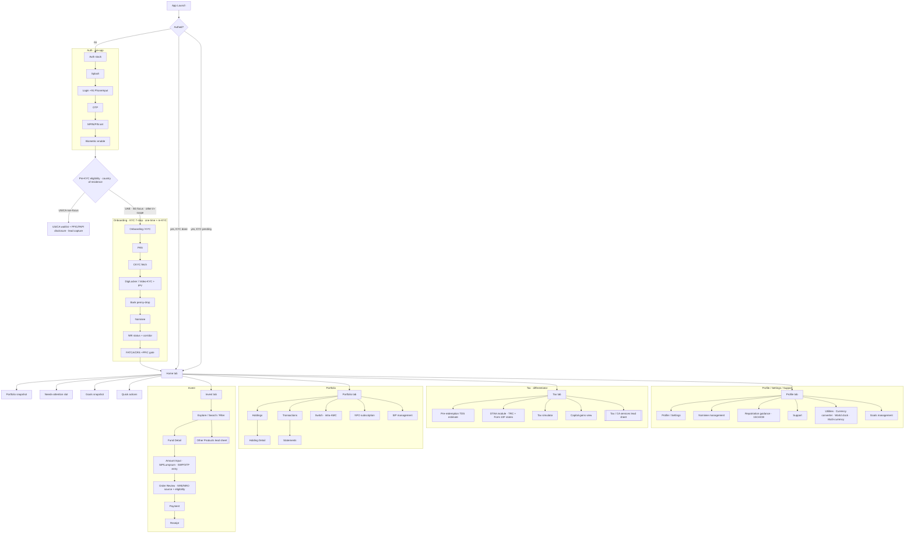

# IA & Sitemap — Phase-1 (Part C)

**Sprint:** Discovery & Definition · Part C (Define)
**Bounded by:** `scope.md` (Phase-1 only). Out-of-scope surfaces are **not** in this IA.
**Grounded in:** rulebook `02-apple-hig-mobile` (one primary action, sheets vs full-screen),
`04-laws-of-ux` (Jakob, Hick, Miller), `05-fintech-nri`.

---

## 1. Nav model — recommendation

**5-tab bottom nav** (Jakob's Law — the convention NRIs already know from Groww/INDmoney),
with the **Tax tab elevated as a first-class destination** — our differentiator made
structural (rulebook 00: "make one brave move").

```
[ Home ]   [ Invest ]   [ Portfolio ]   [ Tax ]   [ Profile ]
```

- **Home** — dashboard state-machine (hook surface, "needs attention", goals snapshot).
- **Invest** — Explore / search / filter → Fund detail → buy flows; "Other products" lead sheet.
- **Portfolio** — holdings, transactions, statements, switch, NFO, **SIP management**.
- **Tax** — TDS estimate, **DTAA module**, simulator, capital-gains; "CA services" lead sheet.
- **Profile** — settings, support, nominee, repatriation guidance, utilities (converter, world clock).

**Why not 4 or 6:** 4 buries Tax (kills the differentiator); 6+ violates Hick/Miller. Utilities
live under Profile + surface **contextually** (e.g. currency toggle on any money screen), not as
a tab. Auth + KYC are **pre-app flows**, not tabs.

---

## 2. Sitemap (Phase-1)



---

## 3. Screen inventory + priority

Priority = build order signal (RICE lands in Part D `backlog.md`).
**P0** = pipeline-proof + core loop · **P1** = complete the core journeys · **P2** = round out Phase-1.

| Area | Screen | Priority | Notes / dependency |
|---|---|---|---|
| Auth | Splash · Login(+91) · OTP · MPIN · Biometric | **P1** | gate to everything; state-frames needed |
| Eligibility | **Pre-KYC eligibility check** (country of residence) | **P1** | early gate (§C1); routes US/CA → waitlist before wasted effort |
| Eligibility | US/CA waitlist + PFIC/FAPI disclosure (lead capture) | **P2** | Path B only; non-focus corridor |
| KYC | 7 steps + status tracker + re-KYC | **P1** | biggest abandonment risk; needs "why we ask" + live status |
| Home | Dashboard (4 states) + attention slot | **P0** | hook surface; state-machine |
| Invest | Explore/Filter | **P1** | |
| Invest | **Fund Detail** | **P0** | *pipeline-proof screen (CLAUDE.md first-run)* |
| Invest | Amount Input (SIP/lumpsum) | **P0** | core loop |
| Invest | Order Review (NRE/NRO + eligibility) | **P0** | compliance-critical |
| Invest | Payment · Receipt | **P0** | Peak-End moment |
| Invest | Other Products lead sheet | **P2** | capture-only |
| Portfolio | Holdings · Holding Detail | **P0** | after-tax/repatriable labelling |
| Portfolio | Transactions · Statements | **P1** | |
| Portfolio | Switch · NFO · SIP mgmt | **P2** | |
| Tax | Pre-redemption TDS estimate | **P0** | **spearhead hook H1** |
| Tax | DTAA module (TRC/10F states) | **P1** | hook H2; Arjun |
| Tax | Simulator · Capital-gains | **P2** | |
| Tax | CA services lead sheet | **P2** | capture-only |
| Profile | Settings · Support | **P1** | |
| Profile | Nominee · Repatriation (15CA/CB) | **P2** | guidance UX only |
| Profile | Utilities (converter/world clock/multi-currency) | **P2** | + contextual |
| Global | State frames (empty/loading/error/offline) | **P1** | rulebook 05: errors recover, never dead-end |

**Cross-cutting (every screen):** trust strip where money appears (SEBI/ARN, "as of"),
tabular cream numerals, one primary action, safe areas, APCA-compliant contrast.

---

## 4. Open IA questions (for Ashish / validate)
- ✅ **US/CA gate placement — DECIDED:** an **early pre-KYC eligibility check** (country of
  residence) routes US/CA → **Path B waitlist** *before* any wasted KYC effort (§C1). Country
  is re-confirmed at KYC step 6 for corridor-specific rules (DTAA/FATCA).
- **Goals:** Home-surfaced snapshot + full management under Profile — or its own stack? [assumption]
- **India-visit mode:** contextual touches (recommended) vs a full mode — scope.md "ambiguous → ask Ashish".
